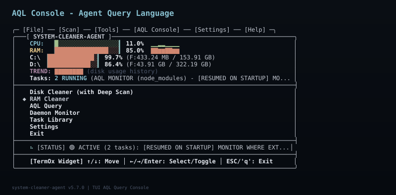
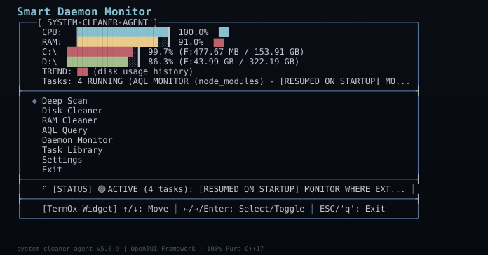
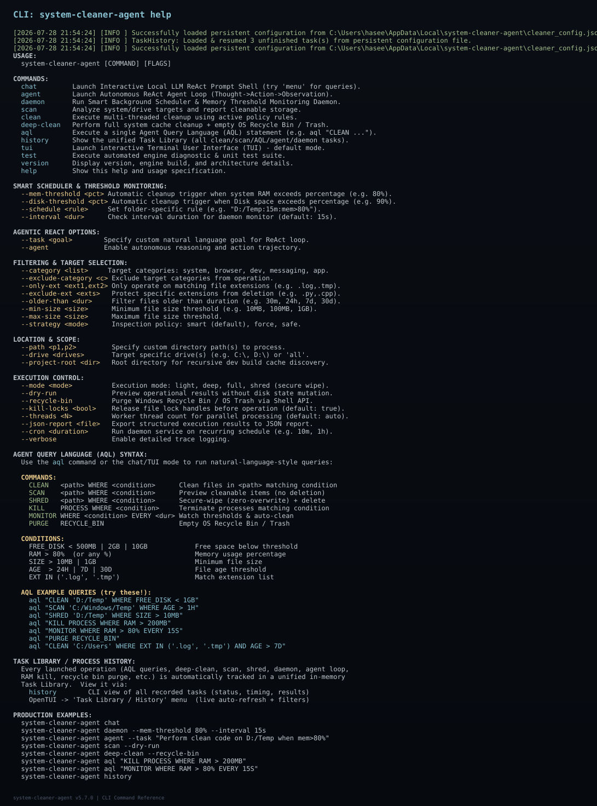
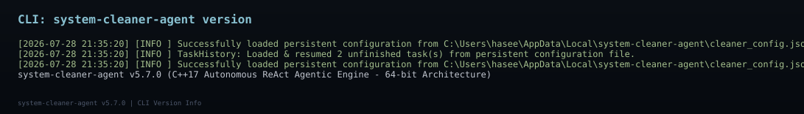
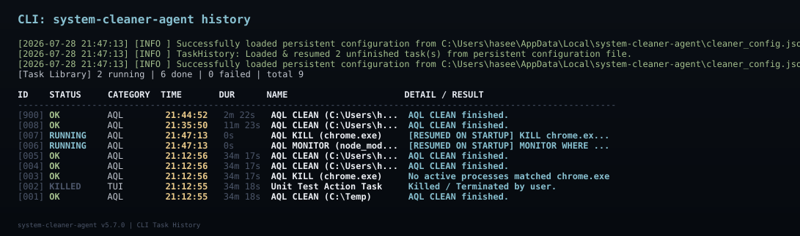

# system-cleaner-agent v5.7.0

> **100% Pure C++17 Autonomous ReAct Agentic Storage Optimization Engine & OpenTUI Framework**

[](https://github.com/haseeb-heaven/system-cleaner-agent)
[](https://en.cppreference.com/w/cpp/17)
[](https://github.com/haseeb-heaven/system-cleaner-agent)
[](https://github.com/haseeb-heaven/system-cleaner-agent)
[](https://github.com/haseeb-heaven/system-cleaner-agent)
[](https://github.com/haseeb-heaven/system-cleaner-agent/releases/latest)

---

## 📸 Screenshots

### Main Menu - Live CPU/RAM/Disk Monitoring with Sparklines


*The main menu shows real-time CPU, RAM, and disk usage with **color-coded progress bars** and **sparkline trend charts** (▁▂▃▄▅▆▇█). The headers auto-refresh based on the Monitor Interval setting (1s/3s/5s/10s/15s/30s/60s).*

### Settings Menu - Configure All TUI Options


*Navigate with **Left/Right** arrow keys to instantly toggle settings. **1 second (LIVE)** mode is available for ultra-fast monitoring.*

### Disk Cleaner Suite


*Multi-drive parallel scanning, deep storage hotspot analysis, smart deep clean, browser caches, developer caches, secure shred wipe, and OS Recycle Bin purge.*

### RAM Cleaner - Process Management


*Quick RAM optimization, OS memory working set trimming, browser memory purge, and high-RAM process termination with permission management.*

### AQL Console - Agent Query Language



*Natural language Agent Query Language (AQL) for autonomous operations. Example: `KILL chrome.exe WHEN RAM > 1GB`.*

### Smart Daemon Monitor



*Background scheduler that watches RAM, disk free space, and triggers automatic cleanup when thresholds are exceeded.*

### Task Library - Persistent History


*All tasks (clean, scan, AQL, agent, daemon) are saved to `cleaner_config.json` and auto-resumed on startup.*

### CLI: Help Output



*Full CLI command reference with all options documented.*

### CLI: Version Output



*Version and architecture information.*

### CLI: Task Library (History)



*Persistent task history accessible via `history` command.*

---

## 💬 Agent Query Language (AQL)

AQL is the natural-language command interface for autonomous storage operations. The AQL engine parses your query and routes it to the right subsystem (Disk, RAM, Process, Recycle Bin, Daemon).

### AQL Command Verbs

| Verb | Action | Example |
|------|--------|---------|
| `CLEAN` | Delete temp/cache files | `CLEAN TEMP_C WHERE DISK_C < 500MB` |
| `SCAN` / `SELECT` | Scan without deleting | `SELECT 'D:/Temp' WHERE SIZE > 100MB` |
| `SHRED` / `WIPE` | Zero-overwrite secure delete | `SHRED 'C:/Users/x/Downloads/old.exe'` |
| `KILL` / `TERMINATE` | End a process | `KILL chrome.exe FROM PROCESS WHERE RAM > 1GB` |
| `MONITOR` / `WATCH` | Recurring threshold check | `MONITOR WHERE RAM > 80% EVERY 15S` |
| `PURGE` / `EMPTY` / `TRASH` | Empty Recycle Bin / Trash | `PURGE RECYCLE_BIN` |

### AQL WHERE Conditions

```
DISK_C < 500MB     # Drive C free space below 500MB
DISK_D < 2GB       # Drive D free space below 2GB
FREE_DISK < 10GB   # Free space below 10GB (any drive)
RAM > 80%         # System RAM usage above 80%
RAM > 200MB        # Process RAM usage above 200MB
MEMORY > 1GB       # Process memory above 1GB
SIZE > 10MB        # File size above 10MB
SIZE > 1GB         # File size above 1GB
AGE > 24H          # File older than 24 hours
AGE > 7D           # File older than 7 days
EXT IN ('.tmp', '.log')   # Only these extensions
EVERY 15S         # Run every 15 seconds (for MONITOR)
EVERY 5H          # Run every 5 hours (for MONITOR)
```

### AQL Target Aliases

AQL recognizes friendly aliases that expand to real OS paths across **Windows**, **Linux**, and **macOS**:

| Alias | Windows | Linux/macOS |
|---|---|---|
| `TEMP_C` | `%USERPROFILE%\AppData\Local\Temp`, `%WINDIR%\Temp` | `/tmp`, `/var/tmp` |
| `TEMP_D` | `D:\Temp`, `D:\Cache` | n/a |
| `APPDATA` | `AppData\Local\Temp`, `AppData\Local\Caches`, `AppData\Roaming\npm-cache` | `~/.cache`, `~/Library/Caches` |
| `CACHE` | Chrome, Edge, Firefox cache folders | n/a |
| `RECYCLE_BIN` | Windows Recycle Bin | OS Trash (Linux: `~/.local/share/Trash`) |

### Ready-Made AQL Query Examples

```bash
# Kill Chrome when it exceeds 80% RAM
system-cleaner-agent aql "KILL chrome.exe FROM PROCESS WHERE RAM > 80%"

# Clean temp files when drive C has less than 500MB free
system-cleaner-agent aql "CLEAN TEMP_C WHERE DISK_C < 500MB"

# Aggressive clean of AppData when drive C has less than 1GB free
system-cleaner-agent aql "CLEAN APPDATA WHERE DISK_C < 1GB"

# Background daemon: monitor RAM and auto-clean node_modules every 5H
system-cleaner-agent aql "MONITOR WHERE EXT IN ('.pyc', '.cache', 'node_modules') EVERY 5H"

# Secure-shred files larger than 10MB in temp folder
system-cleaner-agent aql "SHRED 'C:\Users\hasee\AppData\Local\Temp' WHERE SIZE > 10MB"

# Empty the Recycle Bin
system-cleaner-agent aql "PURGE RECYCLE_BIN"

# Multi-condition: clean only if RAM is high AND drive is low
system-cleaner-agent aql "CLEAN TEMP_C WHERE RAM > 70% AND DISK_C < 1GB"

# Target specific file extensions
system-cleaner-agent aql "CLEAN 'C:/Users/Admin/AppData/Local/Temp' WHERE EXT IN ('.tmp', '.log', '.cache')"

# Terminate specific process by executable name
system-cleaner-agent aql "KILL notepad.exe"
```

### Cron-Style AQL (Persistent Daemon Jobs)

Use `EVERY <duration>` in a MONITOR query to make it a persistent background job. AQL parses the duration suffix (`S`/`M`/`H`/`D`) and registers the job in the unified Task Library so it auto-resumes on startup.

```powershell
# Monitor every 30 seconds and clean if RAM > 85%
.\system-cleaner-agent.exe aql "MONITOR WHERE RAM > 85% EVERY 30S"

# Watch node_modules growth every 2 hours
.\system-cleaner-agent.exe aql "MONITOR WHERE EXT IN ('.pyc', '.cache', 'node_modules') EVERY 2H"

# Background sweep every 5 minutes when disk is low
.\system-cleaner-agent.exe aql "CLEAN TEMP_C WHERE DISK_C < 500MB EVERY 5M"
```

### AQL Syntax Validator

AQL validates every query before execution. Invalid queries return a **real-time error message** with a **suggested fix hint** instead of silently failing. The validator is exposed as `AQLEngine::Validate(query) -> {isValid, errorMessage, suggestedHint}` so AI agent frameworks can introspect queries before sending them.

---

## 🤖 Autonomous ReAct AI Agent

Beyond AQL single-shot commands, the **AgentEngine** (`include/AgentEngine.hpp`) runs a full **Reasoning + Action + Observation (ReAct) loop**. Pass it a natural-language goal and the agent will plan, inspect, act, and verify on its own.

### How the ReAct Loop Works

```
🧭 THOUGHT   → Evaluate system state + reason about goal
🧭 ACTION    → INSPECT_SYSTEM_RESOURCES()
🧭 OBSERVE  → RAM=86%, DiskFree=595MB
🧭 THOUGHT   → Free space is below 500MB threshold, trigger cleanup
🧭 ACTION    → TRIGGER_FREE_SPACE_CLEANUP()
🧭 OBSERVE  → Disk free space trigger matched!
🧭 THOUGHT   → Check for process handle locks on temp dirs
🧭 ACTION    → RELEASE_PROCESS_LOCKS(targets=[mintty, cat, bash, werfault])
🧭 OBSERVE  → Released 3 lock handle(s).
🧭 THOUGHT   → Verify file magic bytes to protect user data
🧭 ACTION    → INSPECT_FILE_MAGIC_BYTES(rules=[source_code, docs, db, images])
🧭 OBSERVE  → All user source files protected.
🧭 THOUGHT   → Execute parallel cleanup of verified junk locations
🧭 ACTION    → EXECUTE_PARALLEL_CLEANUP(threads=auto)
🧭 OBSERVE  → Reclaimed 12.4 GB of storage space.
🧭 THOUGHT   → Verify goal satisfaction
🧭 ACTION    → VERIFY_GOAL_SATISFACTION()
🧭 OBSERVE  → ✓ Goal condition satisfied!
```

### Running the ReAct Agent

```powershell
# CLI: dry-run mode (preview without deleting)
.\system-cleaner-agent.exe agent --task "Free up disk space" --dry-run

# CLI: real cleanup mode
.\system-cleaner-agent.exe agent --task "Clean temp folders and optimize drive storage"

# CLI: target a specific drive with threshold
.\system-cleaner-agent.exe agent --task "Clean D:/Temp when free space is less than 2GB" --drive D:\

# CLI: memory cleanup with threshold
.\system-cleaner-agent.exe daemon --mem-threshold 85% --disk-threshold 90% --interval 30s
```

### How AI Agents / LLM Frameworks Can Use This

The CLI is designed to be driven by AI agent frameworks (AutoGPT, LangChain agents, OpenAI function-calling, custom bots). There are three integration patterns:

**1. Shell out to the binary with a goal**

```python
import subprocess
result = subprocess.run([
    ["./system-cleaner-agent", "agent",
     "--task", "Free up at least 5GB on C: drive",
     "--dry-run"],
    capture_output=True, text=True
)
print(result.stdout)
```

**2. Fire AQL queries from your agent**

```python
import subprocess
result = subprocess.run([
    ["./system-cleaner-agent", "aql",
     "KILL chrome.exe FROM PROCESS WHERE RAM > 1GB"],
    capture_output=True, text=True
)
```

**3. Use the built-in interactive Chat shell**

```powershell
# ReAct prompt shell: type natural language goals
.\system-cleaner-agent.exe chat
chat> "Wipe all temp files older than 7 days"
chat> "Kill any process using more than 1GB RAM"
chat> "menu"   # <-- jump to the OpenTUI dashboard
```

### Intent Classification (LocalLLMBrain)

The `LocalLLMBrain::ReasonOnGoal(userGoal)` function classifies a natural-language goal into one of these intents, with associated thoughts and actions:

| Intent | Trigger Keywords | Action Plan |
|---|---|---|
| `SECURE_SHRED_CLEANUP` | shred, secure, wipe | Switch to shred mode, release locks, zero-overwrite delete |
| `PURGE_OS_TRASH` | recycle, trash, empty | Query OS Shell API, invoke purge without prompts |
| `DISK_FREE_THRESHOLD_MONITOR` | disk, free, less than, below, space, 500MB | Inspect FS, evaluate threshold, target cleanup |
| `PROCESS_KILL_ACTION` | kill, proc, process, chrome, firefox | GTLibc process table, audit, terminate |
| `MEMORY_THRESHOLD_MONITOR` | mem, ram, threshold, memory | Native OS RAM, daemon monitoring |
| `STORAGE_OPTIMIZATION` | (default) | Full autonomous multi-step cleanup |

Each intent returns a list of `thoughts` and `actions` that the ReAct loop iterates over. AI agent frameworks can inspect the `GeneratedThought` struct (`intent`, `thoughts[]`, `actions[]`, `confidence`) to decide how to proceed.

---

## ⚡ Default OpenTUI Mode

Running `system-cleaner-agent` with no arguments or `--tui` launches the key-navigable **OpenTUI Interactive Dashboard**:

```powershell
.\system-cleaner-agent.exe
# or
.\system-cleaner-agent.exe --tui
```

---

## Key Features

- ⚡ **100% Pure Native C++17 Engine**: Zero scripting overhead, native speed.
- 🧠 **Autonomous ReAct Agent Loop**: Self-directed storage optimization trajectory.
- 💻 **OpenTUI Framework**: Zero-dependency cross-platform TUI with ANSI escape sequences.
- 📊 **Live CPU/RAM/Disk Monitoring**: Color-coded progress bars + sparkline trend charts.
- 🛡 **Content Protection Shield**: Validates magic bytes and protects user source code.
- 🔓 **Process Lock Manager**: Releases process handles locking temporary paths.
- 🔒 **Secure Zero-Overwrite Shredding**: Overwrites junk files with binary zeros.
- 🧪 **Unit Test Suite**: 100% pass rate across all engine components.
- 📁 **Persistent Configuration**: All settings auto-saved to `cleaner_config.json`.

---

## CLI Options & Usage

```
USAGE:
  system-cleaner-agent [COMMAND] [FLAGS]

COMMANDS:
  chat         Launch Interactive Local LLM ReAct Prompt Shell (try 'menu' for queries).
  agent        Launch Autonomous ReAct Agent Loop (Thought->Action->Observation).
  daemon       Run Smart Background Scheduler & Memory Threshold Monitoring Daemon.
  scan         Analyze system/drive targets and report cleanable storage.
  clean        Execute multi-threaded cleanup using active policy rules.
  deep-clean   Perform full system cache cleanup + empty OS Recycle Bin / Trash.
  aql          Execute a single Agent Query Language (AQL) statement.
  history      Show the unified Task Library (all clean/scan/AQL/agent/daemon tasks).
  tui          Launch interactive Terminal User Interface (TUI) - default mode.
  test         Execute automated engine diagnostic & unit test suite.
  version      Display version, engine build, and architecture details.
  help         Show this help and usage specification.

SMART SCHEDULER & THRESHOLD MONITORING:
  --mem-threshold <pct>    Automatic cleanup trigger when system RAM exceeds percentage.
  --disk-threshold <pct>   Automatic cleanup trigger when Disk space exceeds percentage.
  --schedule <rule>        Set folder-specific rule (e.g. "D:/Temp:15m:mem>80%").
  --interval <dur>         Check interval duration for daemon monitor (default: 15s).

AGENTIC REACT OPTIONS:
  --task <goal>            Specify custom natural language goal for ReAct loop.
  --agent                  Enable autonomous reasoning and action trajectory.

FILTERING & TARGET SELECTION:
  --category <list>        Target categories: system, browser, dev, messaging, app.
  --only-ext <exts>        Only clean matching file extensions (e.g. .log,.tmp).
  --exclude-ext <exts>     Protect specific extensions from deletion (e.g. .py,.cpp).
  --older-than <dur>       Filter files older than duration (e.g. 30m, 24h, 7d).

LOCATION & SCOPE:
  --path <p1,p2>           Specify custom directory path(s) to process.
  --drive <drives>         Target specific drive(s) (e.g. C:\, D:\) or 'all'.

EXECUTION CONTROL:
  --mode <mode>            Execution mode: light, deep, full, shred (secure wipe).
  --dry-run                Preview operational results without disk state mutation.
  --recycle-bin            Purge Windows Recycle Bin / OS Trash via Shell API.
  --kill-locks <bool>      Release file lock handles before operation.
  --json-report <file>     Export structured execution results to JSON report.
```

---

## 📦 Download

Download the latest Windows x64 binary from the [Releases page](https://github.com/haseeb-heaven/system-cleaner-agent/releases/latest):

**[⬇ Download system-cleaner-agent v5.7.0 (Windows x64)](https://github.com/haseeb-heaven/system-cleaner-agent/releases/latest)**

---

## License

MIT License © 2026 system-cleaner-agent Project.
