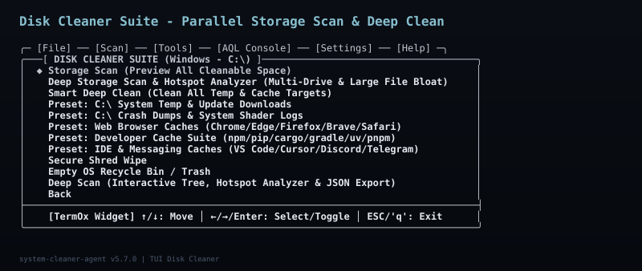
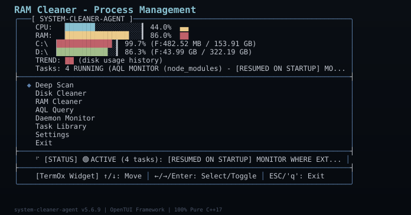
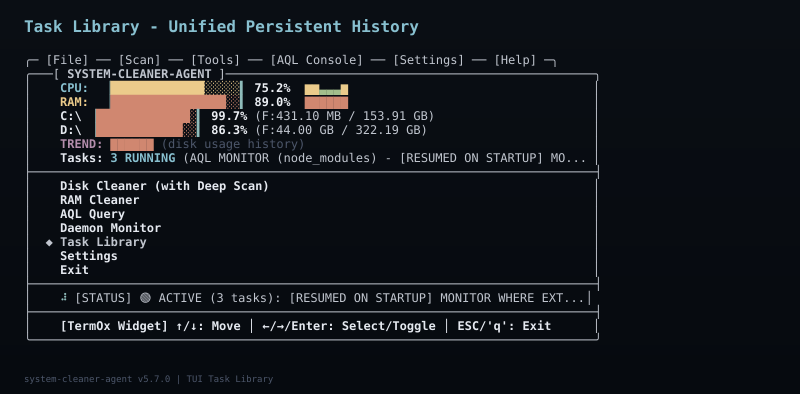
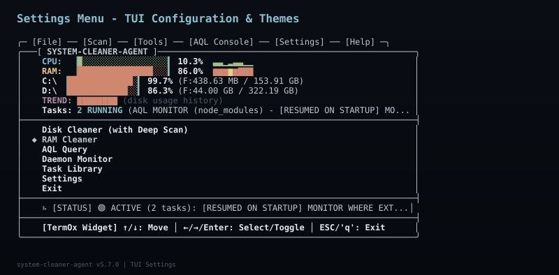

# system-cleaner-agent v5.7.2

> **100% Pure C++17 Autonomous ReAct Agentic Storage Optimization Engine & OpenTUI Framework**

[](https://github.com/haseeb-heaven/system-cleaner-agent)
[](https://en.cppreference.com/w/cpp/17)
[](https://github.com/haseeb-heaven/system-cleaner-agent)
[](https://github.com/haseeb-heaven/system-cleaner-agent)
[](https://github.com/haseeb-heaven/system-cleaner-agent)
[](https://github.com/haseeb-heaven/system-cleaner-agent/releases/latest)

---

## 🚀 Key Features

- ⚡ **100% Native C++17 Core Engine**: Zero external scripting runtime dependencies with instant startup execution.
- 🧠 **Autonomous ReAct Agent Loop**: Goal-directed reasoning trajectory (`Thought -> Action -> Observe -> Verify`).
- 💻 **OpenTUI Reactive Dashboard**: Terminal UI with live CPU/RAM/Disk sparklines and color-coded progress bars.
- 💬 **Agent Query Language (AQL)**: Natural-language command parser for single-shot & persistent storage operations.
- 🛡️ **Built-in Security Shield**: Path Protection Guard and Sandbox Dry-Run mode to prevent accidental data loss.
- 🔒 **Zero-Overwrite Shredding**: Multi-pass binary zero wiping for secure file destruction.
- 📁 **Unified Task Library**: Persistent task history saved to `cleaner_config.json` that auto-resumes across system reboots.

---

> [!IMPORTANT]
> **🛡️ Security Shield & Safety Recommendation**
> `system-cleaner-agent` includes enterprise-grade data safety mechanisms:
> - **Path Protection Guard (`pathProtection: ON`)**: Blocks deletion of OS directories (`C:\Windows`, `/usr`, `/bin`), user documents, and source repositories.
> - **Sandbox Mode (`sandboxMode: ON`)**: Previews all file operations in dry-run mode without modifying disk state.
> - **Dangerous Command Guard**: Risky operations and unsafe path deletes are automatically intercepted and blocked.
> 
> **💡 Recommendation**: We strongly recommend keeping **Path Protection** and **Sandbox Mode** enabled in the Settings menu or via CLI flags to ensure all system and personal files remain 100% safe.

---

## 📚 Quick Documentation Links

For detailed guides, grammar specifications, and engine design:

- 📖 **[COMMANDS.md](COMMANDS.md)** - Full Agent Query Language (AQL) syntax, verbs, WHERE clauses, and CLI flag references.
- 📜 **[CHANGELOG.md](CHANGELOG.md)** - Version release history, features added, and bug fix logs.
- 🏗️ **[docs/ARCHITECTURE.md](docs/ARCHITECTURE.md)** - Engine architecture, ReAct reasoning loop, and OpenTUI layout engine.

---

## 📸 Interactive TUI Screenshots

### Main Menu - Live CPU/RAM/Disk Dashboard


*The main menu shows real-time CPU, RAM, and disk usage with **color-coded progress bars** and **sparkline trend charts** (▁▂▃▄▅▆▇█). The headers auto-refresh based on the Monitor Interval setting.*

### Disk Cleaner Suite - Parallel Storage Scan & Presets



*Multi-drive parallel scanning, deep storage hotspot analysis, smart deep clean, browser caches, developer caches, secure shred wipe, and OS Recycle Bin purge.*

### RAM Cleaner - Memory Optimization & Process Manager



*Quick RAM optimization, OS memory working set trimming, browser memory purge, and high-RAM process termination with permission management.*

### Task Library - Unified Persistent Task History



*All tasks (clean, scan, AQL, agent, daemon) are saved to `cleaner_config.json` and auto-resumed on startup.*

### Settings Menu - Configure All TUI & Safety Options



*Configure Sandbox Mode, Path Protection, Process Protection Whitelist, TUI Theme Engines, and Color Schemes.*

---

## 💡 Quick Usage Examples

### 1. Launch OpenTUI Dashboard
```powershell
.\system-cleaner-agent.exe
```

### 2. Run Autonomous ReAct Agent Goal
```powershell
.\system-cleaner-agent.exe agent --task "Free up at least 5GB on C drive" --dry-run
```

### 3. Single-Shot AQL Statement
```powershell
.\system-cleaner-agent.exe aql "CLEAN TEMP_C WHERE DISK_C < 500MB"
```

### 4. Background Smart Daemon Watch
```powershell
.\system-cleaner-agent.exe daemon --mem-threshold 80% --interval 15s
```

*For complete command syntax, AQL grammar rules, and CLI flags, see **[COMMANDS.md](COMMANDS.md)**.*

---

## 📦 Download & Release

Download the latest pre-compiled binary for Windows x64:

**[⬇ Download system-cleaner-agent v5.7.2 (Windows x64)](https://github.com/haseeb-heaven/system-cleaner-agent/releases/latest)**

---

## 📄 License

MIT License © 2026 system-cleaner-agent Project.
